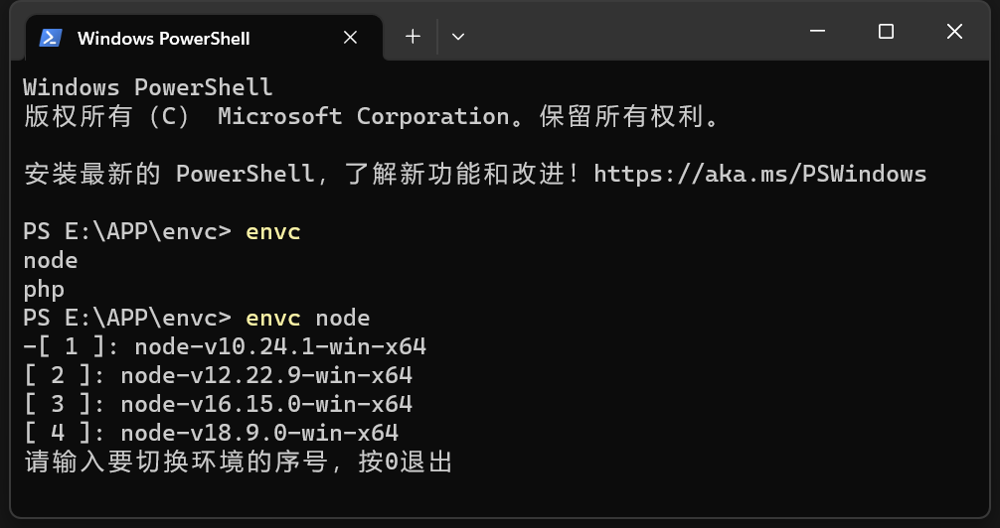

<h1 align="center">envc</h1>

# windows环境变量切换 版本切换



**envc** 是一个快速切换环境变量的工具，特别是存在多个版本的环境变量时由为方便，如实现node版本切换、php版本切换等。这是对不喜欢用 **idea** 的代替方案。

缺点：由于是修改环境变量，修改后仍需重启终端生效。

## 安装

要安装 envc，您可以下载预编译的二进制文件，也可以从源代码编译它。

### 下载

请到 [发行版本](https://github.com/miniwater/envc/releases)
中进行下载最新版本。然后在windows的环境变量修改用户变量，`Path`变量追加：
`%Envc%;<envc.exe程序所在路径>;`

### 构建

要构建，请下载源代码并运行：

```shell
go build
```

## 使用

在envc同级目录里创建文件夹以区分不同环境，在创建的文件夹里放入不同版本环境。
目录示例:

```md
├─ node
│  ├─ node-v10.24.1-win-x64
│  │  ├─ node.exe
│  │  ├─ npm
│  │  └─ ...
│  ├─ node-v18.9.0-win-x64
│  │  ├─ node.exe
│  │  ├─ npm
│  │  └─ ...
│  └─ ...
├─ php
│  ├─ php-7.4.27-Win32-vc15-x64
│  │  ├─ php.exe
│  │  └─ ...
│  ├─ php-8.0.15-Win32-vs16-x64
│  │  ├─ php.exe
│  │  └─ ...
│  └─ ...
└─ envc.exe
```

终端运行`envc node`切换不同`node`版本。示例：

```shell
C:\Users\用户> envc node
[ 1 ]: node-v10.24.1-win-x64
[ 2 ]: node-v12.22.9-win-x64
[ 3 ]: node-v16.15.0-win-x64
-[ 4 ]: node-v18.9.0-win-x64
请输入要切换环境的序号，按0退出
1
```

```shell
C:\Users\用户> node -v
v10.24.1
```

由 `-` 开头的node版本为当前生效的版本，切换后会修改环境变量`Envc`的值，但cmd终端和powershell终端仍需重启才能生效。

## 计划任务

- [ ] 执行文件在bin目录下的环境变量
- [ ] 自动刷新终端环境变量
